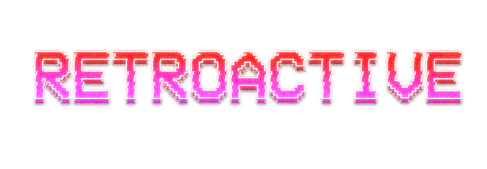

## Welcome! ##
Retroactive is an isometric, temporal racing game, delivered by the students
 from UQ DECO2800 2021 Studio 7.  

## Story ##
> *It's 12:00pm. The year is currently 1982. It's a school night. You've nearly
 finished your new game, but your mother is awake and she knows that you are
  too. You have until she reaches your bedroom to finish or else she's going
   to catch you; and if she does? Well, it may as well be the end of the world.*

Delve into the rich and nostalgic world of 80s curfew to navigate obstacles
, adolescence, and forgotten chores to get to bed before your Mum figures out
 you've stayed up late on a school night.  

## Objectives ##
Retroactive challenges players to go as many nights as possible without being
 caught by their Mother. The player must navigate the map to reach their bed
  before the clock reaches midnight! Each level you complete will increase
   your high score, but it will also increase game difficulty.  
  
  As the game progresses, the map will expand, obstacles will increase, and
   the number of chores the player must complete before they can get to bed
    will increase.

Whatever you do, don't get caught or its all over!  

## Controls ##
**Movement:** W A S D keys  
**Interact:** E  
**Sprint:** hold down shift bar  
**Toggle chore list:** O key

## Usage ##
gradlew clean build# deco2800-engine  

## Sonar Cloud ##
https://sonarcloud.io/dashboard?id=UQdeco2800_2021-studio-7  
